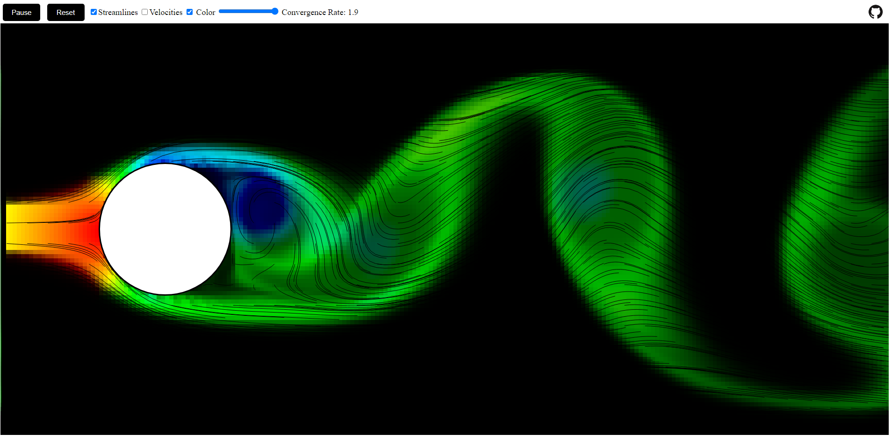
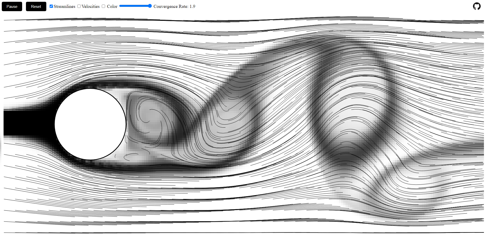

# Fluid Simulation

[Demo Link](https://s-sajid.github.io/fluid-simulation/)

This Eulerian simulation visualizes how a fluid behaves in a two-dimensional space with an interactive object.

## Screenshots

[Project Reference Link](https://github.com/matthias-research/pages/blob/master/tenMinutePhysics/17-fluidSim.html)